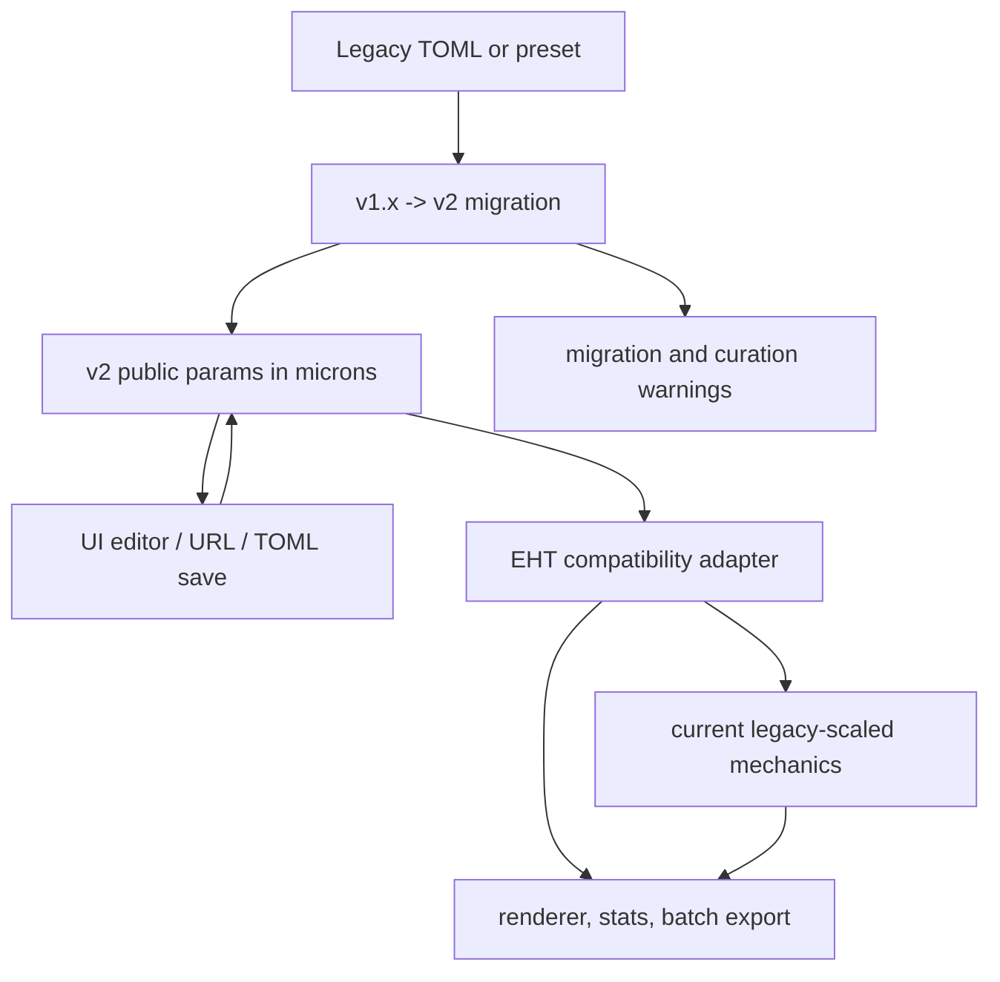
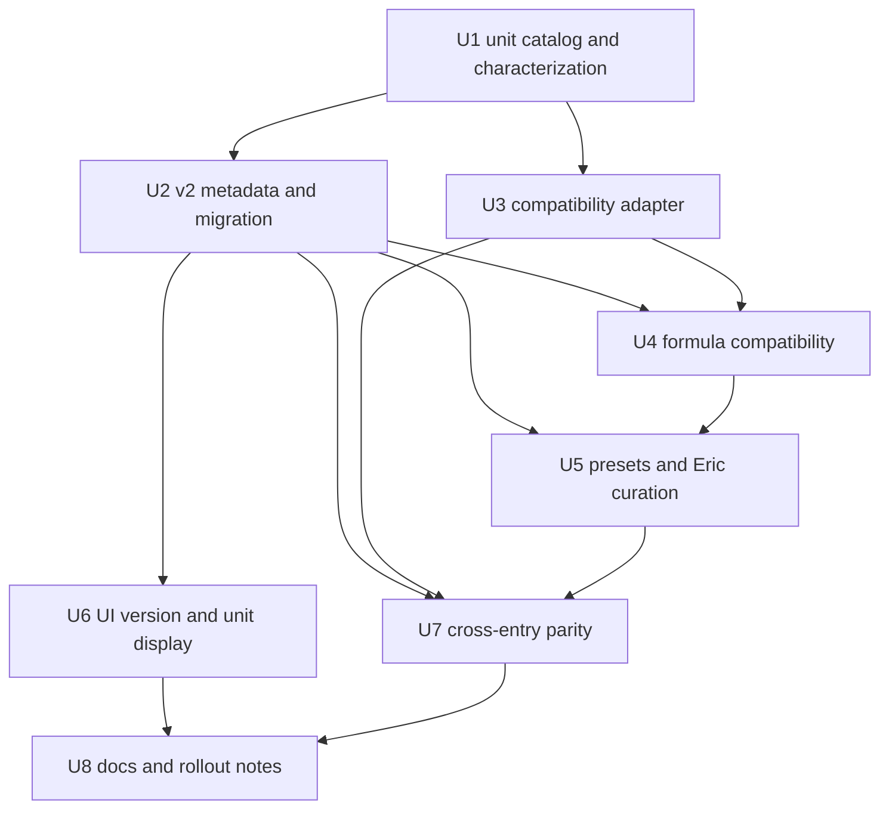
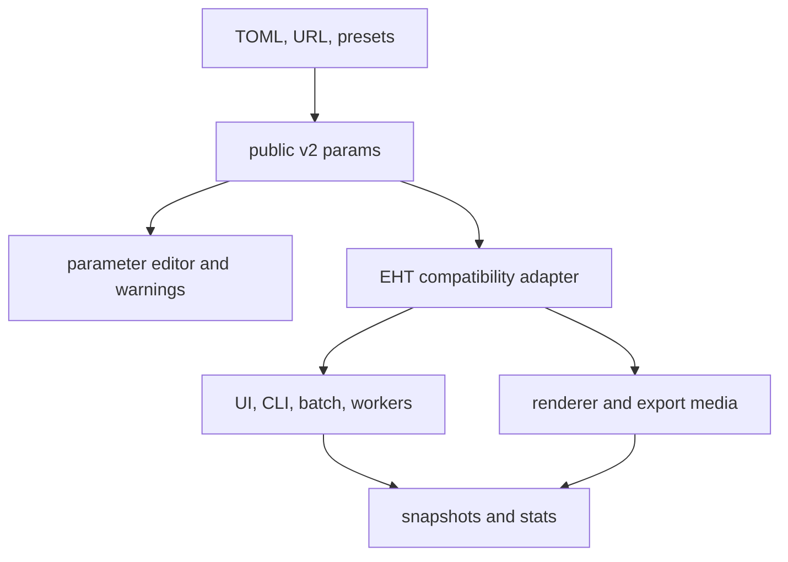

# feat: Introduce v2 micron parameter format

## Summary

Introduce an EHT parameter-file format v2 where length-like values are stored and edited in microns, while the existing simulation mechanics continue to receive legacy-equivalent values through an explicit compatibility adapter. The plan keeps standard legacy files trajectory-equivalent after migration, treats formula-bearing files conservatively, and curates Eric's presets so their public perimeter values match the physical setup names.

---

## Problem Frame

EHT parameters currently mix legacy 5-micron internal calibration with files that already look micron-valued. That ambiguity leaks into TOML files, presets, formulas, UI labels, batch ranges, and rendering; a v2 file format is needed so researchers can read and share physical values without forcing a simultaneous engine rewrite (see origin: docs/brainstorms/2026-05-20-v2-micron-parameter-format-requirements.md).

---

## Requirements

- R1. Advance the EHT parameter-file format to `2.0.0` for the micron-facing length change.
- R2. Store primary length fields in microns: `general.w_init`, `general.h_init`, `general.perimeter`, `cell_types.*.R_soft`, `cell_types.*.R_hard`, and `cell_types.*.R_hard_div`.
- R3. Represent the legacy 5 micron calibration as an explicit compatibility boundary, not as an inference from `R_soft`.
- R4. Treat secondary length-like fields consistently in v2, including screen bounds, cytoskeleton and junction lengths, running speed, diffusion, and batch ranges for converted paths.
- R5. Make the active parameter format visible through metadata and ensure v2 saves write micron-facing values.
- R6. Convert v2 micron-facing values to current legacy simulation values before mechanics are evaluated.
- R7. Preserve trajectories for migrated non-formula legacy files within ordinary floating-point tolerance.
- R8. Preserve existing effective dependencies on `R_soft` in mechanics and compatible formula paths.
- R9. Avoid using `R_soft` as a global scale.
- R10. Do not retune force, stiffness, diffusion, or geometry mechanics for a micron-native engine in this step.
- R11. Do not auto-rewrite arbitrary formulas unless equivalence can be guaranteed.
- R12. Flag formula-bearing files and presets for manual curation when equivalence is uncertain.
- R13. Allow curated length-target formulas to remain micron-facing in saved v2 files while executing behaviorally equivalent values under compatibility mode.
- R14. Curate Eric presets so public `general.perimeter` equals the promised physical perimeter.
- R15. Preserve Eric preset scaled trajectories rather than blindly multiplying every legacy value by 5.
- R16. Mark Eric presets for review when intended equivalence cannot be established from available context.
- R17. Display parameter-file format version separately from registered model version.
- R18. Make affected length fields visibly micron-interpreted in the editor.
- R19. Communicate legacy migration when a file is loaded and migrated.

**Origin actors:** A1 (researcher), A2 (preset curator), A3 (implementation planner)
**Origin flows:** F1 (legacy parameter file migration), F2 (compatibility-mode simulation run), F3 (Eric preset curation)
**Origin acceptance examples:** AE1 (v2 save writes micron values), AE2 (legacy migration preserves trajectory), AE3 (`R_soft` formula behavior is not silently changed), AE4 (Eric preset public perimeter matches setup label), AE5 (UI shows format version and micron units)

---

## Scope Boundaries

- The simulation engine remains internally legacy-scaled for this step.
- Force and stiffness retuning for a future micron-native engine is out of scope.
- Arbitrary symbolic formula rewriting is out of scope unless a target-specific wrapper can preserve equivalence.
- CSV snapshots, TSV exports, statistics rows, and saved simulation state coordinates remain engine-facing unless a later plan adds an outward unit-conversion layer.
- Multi-model parameter format versioning is out of scope; this plan targets the EHT parameter format.

### Deferred to Follow-Up Work

- Micron-native mechanics: remove the compatibility adapter and retune or rederive formulas directly in micron units.
- Output unit conversion: decide whether exported snapshots, frame tables, and statistics should become micron-facing.
- Rich preset provenance: add human-editable curation notes beyond the minimal review/migration metadata needed for this step.

---

## Context & Research

### Relevant Code and Patterns

- `src/models/eht/params/defaults.ts` owns `DEFAULT_EHT_PARAMS`, bundled preset loading, and a model-specific merge path with the current v1.1 through v1.5 migration chain.
- `src/core/params/merge.ts` and `src/core/params/toml.ts` are the generic TOML merge/parse/save paths used by UI loads, URL decode, CLI config loads, and unified simulation configs.
- `src/core/registry/version.ts` already provides semantic version helpers; current migration checks use direct string comparison in places and should move to semver comparisons before v2.
- `src/models/eht/index.ts` and `src/models/eht/headless.ts` both expose EHT model wrappers around `initializeEHTSimulation`, `performTimestep`, stats, snapshots, renderer, and batch parameter generation.
- `src/core/simulation/engine.ts`, `src/hooks/useSimulation.ts`, `src/core/batch/runner.ts`, `src/core/batch/simulation.worker.ts`, `src/core/batch/exportRunner.ts`, and `cli/commands/run.ts` all create engines or run simulations and must see the same compatibility behavior.
- `src/models/eht/simulation/init.ts`, `step.ts`, `forces.ts`, `constraints.ts`, `division.ts`, `events.ts`, and `global-events.ts` contain the current mechanics and formula evaluation behavior that should remain legacy-equivalent.
- `src/models/eht/renderer.ts` computes bounds and draws radii using the same coordinate scale as the simulation state, so rendering needs the same compatibility view as mechanics.
- `src/models/eht/ui/ParametersTab.tsx`, `CellTypesTab.tsx`, `WarningBanner.tsx`, `availableParams.ts`, and `descriptions.ts` provide the editor labels, unit help, warnings, and batch parameter labels users see.
- `src/components/params/ParameterConfigView.tsx`, `ParameterConfigView.test.tsx`, and `src/components/batch/ParameterRangeList.tsx` provide the unified load/save/batch range UI pattern and existing DOM test setup.

### Institutional Learnings

- `docs/solutions/design-patterns/single-scroll-parameter-workspace-2026-05-19.md` emphasizes keeping parameter UI state shared across presentations and protecting dense parameter editor behavior with focused DOM tests. The version/unit display should extend the current shared editor rather than forking a second parameter UI.

### External References

- External research was not needed. The critical decisions are local simulation semantics and file-format compatibility, not framework behavior.

---

## Key Technical Decisions

| Decision | Rationale |
|---|---|
| Keep `metadata.version` as the EHT parameter format version | Existing migrations already use this field through v1.5; the UI can distinguish it from `model.version` by labeling it as the parameter format. |
| Add explicit unit catalogs and a named `LEGACY_MICRONS_PER_UNIT = 5` constant | Conversion should be declarative and reviewable, not scattered through migration and run code or inferred from any cell type. |
| Convert public v2 params to engine params inside the EHT model boundary and renderer/stat wrappers | This keeps the generic simulation engine, CLI, batch workers, and UI call sites mostly model-agnostic while giving every EHT run the same compatibility behavior. |
| Convert standard legacy files by multiplying cataloged length-like values by 5 during v2 migration | The saved file becomes micron-facing while the adapter divides by 5 before the current engine, preserving legacy engine values. |
| Treat Eric presets as curated micron-profile inputs | Eric folders and filenames promise 90, 200, or 900 micron setups. Public v2 values should honor those labels, while verification compares scaled trajectories rather than raw engine coordinates. |
| Preserve curated length-target formulas with formula-scope wrappers instead of rewriting saved formula strings | Saved v2 files should remain human-readable and micron-facing. Runtime wrappers can expose public-scale `old_value`, `init_value`, and spatial variables, then convert length-target results back to engine units. |
| Flag uncertain formulas rather than pretending full equivalence | External force formulas, probability formulas using length variables, and arbitrary formula text may combine dimensions in ways the migration cannot prove. Persistent warnings make curation explicit. |
| Keep outputs engine-facing for this step | The origin explicitly defers snapshot/CSV/stat relabeling unless a later plan adds an outward conversion layer. |

---

## Open Questions

### Resolved During Planning

- Secondary length-like fields: Convert `general.w_screen`, `general.h_screen`, `cell_types.*.max_cytoskeleton_length`, `cell_types.*.running_speed`, `cell_types.*.diffusion`, `cell_types.*.max_basal_junction_dist`, `cell_types.*.cytos_init`, and `cell_types.*.apical_junction_init` along with the primary fields. Do not convert stiffnesses, probabilities, times, damping ratios, colors, counts, `location`, `aspect_ratio`, `basal_membrane_repulsion`, or force constants.
- Hardcoded engine thresholds: Keep thresholds such as running distance checks, signed-distance running activation, renderer padding, and warning margins in legacy engine units for now, but centralize or name them where touched so they are visible future micron-native work.
- Equivalence tolerance: For standard non-formula legacy migrations, compare selected deterministic snapshots with tight numeric tolerance in engine units. For Eric presets, compare normalized coordinates and ratios because the public perimeter correction intentionally changes absolute engine scale.
- Eric preset authority: Use folder/file promised perimeters as authoritative when they match the raw `general.perimeter`. Leave already micron-looking Eric length values public in v2 and let the compatibility adapter scale them for engine execution; mark any inconsistent file for review.

### Deferred to Implementation

- Exact persistent warning shape: choose the final metadata field names while updating the schema, but keep them serializable in TOML and visible in the UI.
- Exact representative snapshot set: choose the smallest seed/timepoint matrix that catches init geometry, one timestep, event-free mid-run state, and terminal-ish state without making the suite slow.
- Exact formula wrapper implementation: choose whether wrappers are stored as internal cloned formulas or evaluated through shared helper functions, as long as saved v2 formula text remains unchanged.

---

## High-Level Technical Design

> *This illustrates the intended approach and is directional guidance for review, not implementation specification. The implementing agent should treat it as context, not code to reproduce.*

---

## Implementation Units

### U1. Define Unit Catalog And Characterization Baseline

**Goal:** Establish the authoritative conversion catalog, semver helpers, and behavior snapshots before changing parameter semantics.

**Requirements:** R2, R3, R4, R6, R7, R8, R9, R10; supports F2 and AE2

**Dependencies:** None

**Files:**
- Create: `src/models/eht/params/unit-conversion.ts`
- Create: `src/models/eht/params/unit-conversion.test.ts`
- Create: `src/models/eht/simulation/compatibility-equivalence.test.ts`
- Modify: `src/core/params/merge.ts`
- Modify: `src/models/eht/params/defaults.ts`

**Approach:**
- Define `LEGACY_MICRONS_PER_UNIT = 5`, `EHT_PARAM_FORMAT_VERSION = "2.0.0"`, and explicit path catalogs for general length fields, cell-type length fields, length-rate fields, and runtime formula length targets.
- Add small helpers for version comparison using `src/core/registry/version.ts` instead of direct string ordering.
- Add characterization fixtures that run a simple non-formula legacy configuration through current behavior before v2 conversion is wired in.
- Treat `diffusion` as length-scaled because it directly changes position increments; treat `running_speed` as length per time; keep stiffness and force magnitudes unchanged.
- Name or document engine-only constants encountered during the change without changing their values.

**Execution note:** Start with characterization coverage so adapter changes have a stable behavioral target.

**Patterns to follow:**
- Follow the existing v1 migration modules' narrow helper style, but keep unit paths centralized instead of duplicating field lists.
- Follow current Vitest scientific tests in `src/models/eht/simulation/formula-params.test.ts` and `global-events.test.ts`.

**Test scenarios:**
- Happy path: catalog scaling converts a sample general config from legacy engine units to public microns and back with exact original numeric values for every cataloged field.
- Happy path: catalog scaling converts multiple arbitrary cell types without relying on `control` or `emt` names.
- Edge case: zero-valued optional lengths such as `max_cytoskeleton_length` and `cytos_init` remain zero after both conversion directions.
- Edge case: non-length values such as `aspect_ratio`, `mu`, stiffnesses, probabilities, event times, colors, and counts remain unchanged.
- Integration: a baseline non-formula simulation produces deterministic snapshots for a fixed seed before v2 migration code is introduced.

**Verification:**
- The conversion catalog is the only place an implementer needs to inspect to understand which parameter paths scale with the 5 micron calibration.
- Characterization snapshots are available for later units to compare against.

---

### U2. Add V2 Metadata, Migration, And TOML Round Trips

**Goal:** Extend the migration chain so legacy parameters and unified simulation config TOML files load into v2 micron-facing params, including compatible batch ranges and persistent migration metadata.

**Requirements:** R1, R2, R3, R4, R5, R7, R11, R12, R19; supports F1, AE1, AE2, and AE3

**Dependencies:** U1

**Files:**
- Create: `src/models/eht/params/migration-v2.0.ts`
- Create: `src/models/eht/params/migration-v2.0.test.ts`
- Modify: `src/models/eht/params/types.ts`
- Modify: `src/models/eht/params/schema.ts`
- Modify: `src/models/eht/params/defaults.ts`
- Modify: `src/core/params/merge.ts`
- Modify: `src/core/params/toml.ts`
- Modify: `src/core/params/url.ts`
- Test: `src/components/params/ParameterConfigView.test.tsx`

**Approach:**
- Add optional metadata fields for migration provenance and curation warnings while keeping `metadata.version` as the parameter format version.
- Update `DEFAULT_EHT_PARAMS` to v2 public micron values by scaling standard default length fields from the legacy baseline.
- Extend both model-specific preset merging and generic TOML merging through v2. Use semver comparison rather than string ordering.
- Convert `parameter_ranges` min/max values when their paths are in the unit catalog and the source config is legacy.
- Ensure `toToml`, `toTomlWithRanges`, `toSimulationConfigToml`, and URL encoding serialize v2 public params rather than adapted engine params.
- Return or persist enough migration information for the UI to show that a legacy load changed visible values.

**Patterns to follow:**
- Keep the v1 migration chain style: small `needsMigration`, `migrate`, and `ensure` helpers with complete tests.
- Preserve `restoreInfinityValues` behavior for old TOML files that use `1e+308`.
- Preserve unified config behavior in `parseSimulationConfigToml`, where batch settings live beside model params.

**Test scenarios:**
- Covers AE1. Given a v1.5 config with `perimeter = 20` and `R_soft = 1`, loading and saving writes `metadata.version = "2.0.0"`, `perimeter = 100`, and `R_soft = 5`.
- Covers AE2. Given a migrated non-formula legacy config, converting the v2 params back to engine values yields the original legacy length values.
- Edge case: a legacy simulation config with `parameter_ranges` targeting `general.perimeter` and `cell_types.control.R_soft` scales range min/max by 5, while a range targeting `stiffness_repulsion` does not scale.
- Edge case: a config already marked v2 is not scaled again on repeated load/save.
- Error path: an unknown or malformed metadata version fails clearly or falls back to the existing legacy default only when that is the current loader behavior.
- Integration: URL encode/decode round trips v2 params without writing legacy-scaled values into the URL payload.

**Verification:**
- Loading any existing standard bundled preset produces v2 metadata and micron-facing length values.
- Saving immediately after loading a legacy file does not write legacy-scaled length values.

---

### U3. Build EHT Compatibility Adapter For Current Mechanics

**Goal:** Ensure all current EHT execution and rendering paths receive legacy-equivalent params when users provide v2 micron-facing params.

**Requirements:** R3, R6, R7, R8, R9, R10; supports F2 and AE2

**Dependencies:** U1, U2

**Files:**
- Create: `src/models/eht/compat/engine-params.ts`
- Create: `src/models/eht/compat/engine-params.test.ts`
- Modify: `src/models/eht/index.ts`
- Modify: `src/models/eht/headless.ts`
- Modify: `src/models/eht/renderer.ts`
- Modify: `src/models/eht/statistics.ts`
- Modify: `src/models/eht/output.ts`
- Test: `src/models/eht/simulation/compatibility-equivalence.test.ts`

**Approach:**
- Add an EHT-specific adapter that clones public v2 params and converts cataloged fields to legacy engine units immediately before `initializeEHTSimulation`, `performTimestep`, renderer bounding-box calculations, renderer drawing fallbacks, and stats computations.
- Keep the generic `SimulationEngine` model-agnostic. The EHT model wrapper is the right boundary because only EHT knows the parameter format semantics.
- Make `EHTModel.init`, `EHTModel.step`, and `EHTHeadlessModel` use the same adapter so UI, CLI, workers, and batch runs remain aligned.
- Ensure the state-local mutable params stored in `initializeEHTSimulation` are engine-facing so global events and geometry rebuilds continue to operate in legacy units.
- Keep `getSnapshot` engine-facing for this step; when `loadSnapshot` receives public v2 params, adapt only the params needed for reconstruction consistency.
- Wrap or delegate renderer calls so a v2 public perimeter does not inflate the viewport while state coordinates remain engine-facing.

**Patterns to follow:**
- Preserve current in-place state mutation and deterministic RNG behavior.
- Mirror the browser and headless EHT model definitions so the two entry points do not drift.
- Follow `src/core/export/offscreenRenderer.ts` expectations that the model renderer owns its own parameter interpretation.

**Test scenarios:**
- Covers AE2. A v1 non-formula config run before migration and the migrated v2 config run through `EHTModel` produce matching selected snapshots for fixed seed/timepoints.
- Happy path: `EHTHeadlessModel` and browser `EHTModel` adapt the same v2 params to identical engine params.
- Edge case: state-local global geometry params are engine-facing after initialization, not public micron-facing.
- Integration: renderer bounding boxes for a migrated v2 config match the legacy bounding boxes rather than scaling up by 5.
- Integration: stats computed from a v2 public config and engine state match stats computed from the equivalent legacy engine config.

**Verification:**
- No call site needs to remember to divide by 5 before running EHT.
- Existing mechanics files do not need broad force or geometry retuning to handle v2 public params.

---

### U4. Preserve Formula And Dynamic Parameter Semantics

**Goal:** Keep formulas behaviorally safe under v2 by adapting provable length-target formulas at runtime and flagging uncertain formula cases for curation.

**Requirements:** R8, R11, R12, R13; supports F2, F3, and AE3

**Dependencies:** U1, U2, U3

**Files:**
- Create: `src/models/eht/compat/formula-units.ts`
- Create: `src/models/eht/compat/formula-units.test.ts`
- Modify: `src/models/eht/simulation/init.ts`
- Modify: `src/models/eht/simulation/events.ts`
- Modify: `src/models/eht/simulation/global-events.ts`
- Modify: `src/models/eht/simulation/cell.ts`
- Modify: `src/models/eht/simulation/external-force-formula.ts`
- Test: `src/models/eht/simulation/formula-params.test.ts`
- Test: `src/models/eht/simulation/global-events.test.ts`
- Test: `src/models/eht/simulation/forces.test.ts`

**Approach:**
- Add shared formula-scope helpers that can evaluate length-target formulas in public micron scope while returning engine-unit results to the current mechanics.
- Apply this only where the target and variable dimensions are known: `general.formulas` for cataloged general lengths, `cell_types.*.formulas` for cataloged cell lengths, global events targeting cataloged general lengths, and parameter-change events targeting known runtime length fields such as `R_soft`, `R_hard`, `eta_A`, and `eta_B`.
- Scale formula scope variables only when they are length-like in the current target context, including `old_value`, `init_value`, `h_init`, `w_init`, `R_hard_div`, `r`, and `delta`; leave `alpha`, probabilities, stiffnesses, and other dimensionless values untouched.
- Do not auto-guarantee external force formulas or probability formulas that combine spatial lengths with force/probability outputs; add warnings for manual curation when such formulas are present.
- Preserve mechanics-level `R_soft` dependencies in force and cytoskeleton calculations by ensuring cell runtime `R_soft` remains engine-facing after adapter/formula processing.

**Patterns to follow:**
- Centralize formula functions rather than copying math.js scope-building logic across `init.ts`, `events.ts`, `global-events.ts`, and `cell.ts`.
- Preserve current error behavior where invalid formulas fall back or warn without crashing the whole simulation.

**Test scenarios:**
- Covers AE3. A migrated v1 formula targeting `R_soft` is flagged when equivalence is uncertain and is not silently rewritten in the saved v2 file.
- Covers AE3. A curated v2 formula targeting `R_soft` with a micron-facing value evaluates to the same effective engine `R_soft` that the current force code expects.
- Happy path: a v2 formula targeting `general.perimeter` sees `init_value` and `old_value` in microns, while `state.params.general.perimeter` remains engine-facing after evaluation.
- Edge case: dimensionless formula targets such as `aspect_ratio`, `INM`, or stiffness values continue to evaluate exactly as before.
- Error path: an invalid length-target formula reports the existing error/fallback behavior and does not leave mixed public/engine units in state.
- Integration: a global event that changes perimeter rebuilds geometry based on engine-facing values while preserving the public-scale formula semantics.

**Verification:**
- Formula text saved in v2 TOML remains human-facing; runtime conversion happens on cloned/adapted params.
- Force calculations that depend on runtime `R_soft` continue to see the intended legacy-scale radius.

---

### U5. Curate Bundled Presets And Eric Families

**Goal:** Update bundled presets to v2 and handle Eric's already micron-looking setup families with explicit curation rules and review warnings.

**Requirements:** R1, R2, R5, R11, R12, R14, R15, R16; supports F1, F3, AE1, AE3, and AE4

**Dependencies:** U1, U2, U4

**Files:**
- Modify: `src/models/eht/params/presets/*.toml`
- Modify: `src/models/eht/params/presets/eric/**/*.toml`
- Modify: `src/models/eht/params/defaults.ts`
- Create: `src/models/eht/params/presets/preset-migration.test.ts`

**Approach:**
- Convert standard root presets with the legacy 5 micron scale: public v2 length values become legacy raw values multiplied by 5.
- Convert Eric presets as curated micron-profile files: keep public `general.perimeter` equal to the promised folder/file perimeter and keep already micron-looking length values public when they preserve ratios to that perimeter.
- For Eric files whose raw perimeter does not match the promised family label or whose context is insufficient, mark them with review metadata rather than silently guessing.
- Preserve formula-bearing presets conservatively. For `oscillating-cell-size.toml`, ensure the `R_soft` formula is either manually curated into v2 public microns or carries a curation warning until it is reviewed.
- Keep preset labels and grouping stable so existing UI preset selection remains recognizable.

**Patterns to follow:**
- Keep TOML files readable and avoid generated churn outside the fields required for v2, metadata, and curation status.
- Preserve import-meta preset discovery in `defaults.ts`.

**Test scenarios:**
- Covers AE1. Every bundled preset loaded through `EHT_PRESETS` has `metadata.version = "2.0.0"` and public micron-facing primary length fields.
- Covers AE4. A 200 micron Eric preset loads with public `general.perimeter = 200` and produces normalized geometry ratios matching its pre-curation raw setup.
- Edge case: all Eric 90, 200, and 900 micron families are discovered under nested folders and receive the expected curation profile.
- Error path: a deliberately inconsistent Eric-like fixture is marked for review instead of being auto-migrated as if it were standard legacy.
- Integration: formula-bearing presets load with visible warning metadata when manual curation is still required.

**Verification:**
- Preset dropdown continues to show the expected groups and labels.
- Standard presets preserve legacy engine trajectories; Eric presets preserve scaled trajectories while public perimeters match their names.

---

### U6. Surface Parameter Format Version, Units, And Migration Warnings In UI

**Goal:** Make v2 visible and understandable in the parameter editor without confusing it with the registered model version.

**Requirements:** R5, R17, R18, R19; supports F1 and AE5

**Dependencies:** U2

**Files:**
- Modify: `src/components/params/ParameterConfigView.tsx`
- Modify: `src/components/layout/ModelSelector.tsx`
- Modify: `src/models/eht/ui/ParametersTab.tsx`
- Modify: `src/models/eht/ui/CellTypesTab.tsx`
- Modify: `src/models/eht/ui/WarningBanner.tsx`
- Modify: `src/models/eht/ui/availableParams.ts`
- Modify: `src/models/eht/params/descriptions.ts`
- Test: `src/components/params/ParameterConfigView.test.tsx`

**Approach:**
- Add a compact parameter-format badge or line in the shared parameter workspace, e.g. "Parameter format v2.0.0", distinct from the model selector's model version.
- Show migration provenance and curation warnings near the load/save controls or warning banner when metadata indicates a legacy file was migrated or formulas require review.
- Add concise micron unit affordances for affected general and cell-type length fields. Prefer labels such as "Perimeter (um)" and "R Soft (um)" or small unit text next to numeric inputs; do not add explanatory walls of copy inside the app.
- Update help descriptions for migrated fields to say microns where appropriate and clarify that compatibility mode still runs the current legacy engine.
- Update batch parameter labels for converted length paths so sweep ranges are visibly micron-facing.

**Patterns to follow:**
- Reuse the shared editor body in `ParameterConfigView`; do not create a second parameter editor path.
- Keep dense table labels compact enough for the existing Cell Types layout.
- Follow current warning banner visual language for actionable scientific parameter warnings.

**Test scenarios:**
- Covers AE5. Given v2 params, the parameter workspace displays the parameter format version separately from the model selector version.
- Covers AE5. Given migrated params with provenance metadata, the UI communicates that migration occurred.
- Covers AE5. Affected fields in Parameters and Cell Types display micron units or micron-specific labels.
- Happy path: batch range labels for `general.perimeter` and `cell_types.control.R_soft` indicate micron-facing values.
- Edge case: no migration message appears for a clean v2 default config without warnings.

**Verification:**
- Users can distinguish model version from parameter-file format version without reading TOML.
- The editor makes changed length semantics visible at the fields where users type values.

---

### U7. Verify Cross-Entry Parity For UI, CLI, Batch, Workers, And Export

**Goal:** Prove that all run and export paths use the same v2 migration and compatibility behavior.

**Requirements:** R5, R6, R7, R8, R10; supports F1, F2, AE1, AE2, and AE3

**Dependencies:** U2, U3, U4, U5

**Files:**
- Modify: `cli/commands/run.ts`
- Modify: `cli/commands/batch.ts`
- Modify: `src/core/batch/runner.ts`
- Modify: `src/core/batch/simulation.worker.ts`
- Modify: `src/core/batch/exportRunner.ts`
- Test: `src/models/eht/simulation/compatibility-equivalence.test.ts`
- Test: `src/components/params/ParameterConfigView.test.tsx`
- Test: `src/core/batch/serialization.test.ts`

**Approach:**
- Prefer central adapter and TOML helpers so most entry points inherit behavior without local conversion logic.
- Confirm CLI config loads use v2-migrated public params and then run through `EHTHeadlessModel` compatibility.
- Confirm batch overrides are public v2 values until the model adapter receives the per-run params.
- Confirm worker requests pass public v2 params and rely on the worker-safe EHT model adapter.
- Confirm export ZIP parameter files write public v2 TOML while screenshots/videos render engine-state coordinates with adapted renderer params.
- Add or adjust serialization tests around batch config TOML so ranges and saved per-run params stay micron-facing.

**Patterns to follow:**
- Keep generic batch code generic where possible; EHT-specific conversion belongs in EHT helpers or model wrappers.
- Follow existing batch export behavior that re-simulates runs and writes per-run TOML files when requested.

**Test scenarios:**
- Happy path: CLI single-run output for a migrated v2 config matches the equivalent legacy run's sampled snapshots in engine units.
- Integration: sequential batch and worker batch runs receive identical sampled params and snapshots for the same v2 public ranges.
- Integration: batch export writes per-run `params.toml` with v2 public micron values while rendered screenshot bounds match the equivalent engine-scale view.
- Edge case: applying a v2 public override to `general.perimeter` in CLI or batch does not get scaled twice.
- Error path: a formula-curation warning survives load and save through the unified config path.

**Verification:**
- There is no separate "works in UI but not CLI" unit path.
- Saved config files and exported per-run params remain public v2, even though simulations run adapted engine params.

---

### U8. Add Documentation And Rollout Notes

**Goal:** Document the new parameter format boundary, migration behavior, preset caveats, and deferred micron-native work for future maintainers and users.

**Requirements:** R3, R5, R10, R11, R12, R14, R15, R16, R17, R18, R19

**Dependencies:** U5, U6, U7

**Files:**
- Create: `src/docs/EHT/parameter-format-v2.md`
- Modify: `src/docs/index.md`
- Modify: `src/App.tsx`
- Modify: `CLAUDE.md`
- Test: create or update `src/components/MarkdownPage.test.tsx` if a new docs route is added; otherwise test expectation below applies

**Approach:**
- Add a concise docs page explaining v2 public units, the 5 micron compatibility boundary, which fields are converted, and what remains engine-facing.
- Document formula curation rules, especially the difference between provable length-target formulas and uncertain arbitrary formulas.
- Document Eric preset treatment: promised public perimeter is authoritative; standard legacy presets are exact trajectory-preserving migrations; Eric presets are scaled-trajectory-preserving curation cases.
- Update repository guidance so future parameter semantic changes add a migration rather than relying only on Zod defaults.
- Add a docs route only if it fits the current static-import docs pattern.

**Patterns to follow:**
- Follow the static markdown import route pattern in `src/App.tsx` and existing docs under `src/docs/EHT/`.
- Keep documentation user-facing and avoid implementation-only details that belong in code comments or tests.

**Test scenarios:**
- Test expectation: none for pure markdown content unless a route is added.
- Happy path if a route is added: navigating to the docs route renders the v2 parameter format page through the existing markdown page component.
- Edge case: docs index links the new page without breaking existing EHT model/statistics/formula links.

**Verification:**
- A future implementer can identify the v2 boundary, converted fields, and deferred micron-native work from docs without rediscovering this plan.

---

## System-Wide Impact

- **Interaction graph:** TOML parsing, preset creation, URL decode, UI editing, CLI runs, batch workers, export re-simulation, rendering, stats, and snapshots all consume either public v2 params or engine-adapted clones. The adapter boundary must be clear enough that no path mixes them accidentally.
- **Error propagation:** TOML parse and schema errors should remain visible through existing load error paths. Migration and formula curation warnings should be non-fatal but persistent enough for UI display.
- **State lifecycle risks:** `state.params` is mutable during runs because global events modify it. It must hold engine-facing params so geometry rebuilds and formula events stay compatible.
- **API surface parity:** Browser `EHTModel` and headless `EHTHeadlessModel` must expose identical compatibility behavior. Generic model interfaces should not gain EHT-specific unit assumptions.
- **Integration coverage:** Unit tests alone will not prove parity; at least one deterministic run should compare UI/headless-adapter behavior, batch/worker behavior, and export saved params.
- **Unchanged invariants:** Current mechanics, force formulas, stiffness constants, random seeding, and snapshot coordinate scale are not retuned or relabeled in this first v2 step.

---

## Alternative Approaches Considered

- Make the engine micron-native immediately: Rejected for this step because it would mix file-format migration with mechanics retuning and make trajectory preservation much harder to prove.
- Add a new `metadata.parameter_format_version` separate from `metadata.version`: Rejected for now because existing migrations already treat `metadata.version` as the parameter format version. The UI should disambiguate labels instead of adding a parallel version field.
- Scale by each file's `R_soft`: Rejected because `R_soft` is cell-type-specific, can change dynamically, and is itself one of the migrated public values.
- Blindly multiply every pre-v2 preset by 5: Rejected because Eric preset folders already promise physical perimeters and some raw values are already micron-looking.
- Convert exported snapshots/statistics to microns now: Deferred because the origin excludes outward coordinate relabeling from the first compatibility step.

---

## Success Metrics

- Standard legacy non-formula configs load as v2, save as micron-facing TOML, and run with selected snapshots matching legacy engine snapshots within the chosen tolerance.
- V2 default and standard bundled presets display visibly micron-facing length values and do not scale again on repeated load/save.
- Eric presets display public perimeters matching their 90, 200, or 900 micron setup labels and pass normalized trajectory checks or carry explicit review warnings.
- Formula-bearing configs never silently lose `R_soft` behavior; provable length-target formulas execute compatibly and uncertain formulas surface curation warnings.
- UI, CLI, batch, worker, and export paths all route through the same compatibility behavior.

---

## Risks & Dependencies

| Risk | Mitigation |
|------|------------|
| Double-scaling params during load, save, run, or batch override application | Keep conversion helpers directional and test v2 idempotence, adapter round trips, CLI overrides, batch ranges, and per-run export TOML. |
| Mixing public v2 params with engine-facing simulation state in renderer or stats | Route renderer/stat calls through EHT-specific adapter wrappers and add snapshot/bounding-box tests. |
| Formula wrappers accidentally change arbitrary formula semantics | Only guarantee known length-target formulas; persist warnings for external force and uncertain formulas. |
| Eric curation cannot prove scaled equivalence for every file | Use label-derived rules only where raw perimeter and family context agree; otherwise mark review metadata instead of guessing. |
| Migration metadata clutters TOML or confuses users | Keep metadata fields minimal, documented, and displayed only when actionable. |
| Existing tests assume old default numeric values | Update tests intentionally to distinguish public v2 values from adapted engine values. |

---

## Documentation / Operational Notes

- This is a breaking parameter-file format change. Existing files should load and migrate, but saved files should be treated as v2.
- The model registry `version` remains a model implementation version; `metadata.version` is the parameter-file format version.
- The implementation should keep comments sparse but leave a short orienting comment at the adapter boundary because public and engine units will coexist for a while.
- If the plan is split into multiple changes, land U1 through U3 together before changing bundled presets broadly; preset conversion without adapter coverage would be misleading.

---

## Sources & References

- **Origin document:** [docs/brainstorms/2026-05-20-v2-micron-parameter-format-requirements.md](../brainstorms/2026-05-20-v2-micron-parameter-format-requirements.md)
- Related plan pattern: [docs/plans/2026-05-19-001-feat-parameter-editor-workspace-plan.md](2026-05-19-001-feat-parameter-editor-workspace-plan.md)
- Institutional learning: [docs/solutions/design-patterns/single-scroll-parameter-workspace-2026-05-19.md](../solutions/design-patterns/single-scroll-parameter-workspace-2026-05-19.md)
- Parameter defaults and presets: `src/models/eht/params/defaults.ts`
- Generic TOML merge/serialization: `src/core/params/merge.ts`, `src/core/params/toml.ts`, `src/core/params/url.ts`
- Existing migrations: `src/models/eht/params/migration-v1.1.ts`, `src/models/eht/params/migration-v1.2.ts`, `src/models/eht/params/migration-v1.3.ts`, `src/models/eht/params/migration-v1.4.ts`, `src/models/eht/params/migration-v1.5.ts`
- EHT model wrappers: `src/models/eht/index.ts`, `src/models/eht/headless.ts`
- Simulation mechanics: `src/models/eht/simulation/init.ts`, `src/models/eht/simulation/step.ts`, `src/models/eht/simulation/forces.ts`, `src/models/eht/simulation/events.ts`, `src/models/eht/simulation/global-events.ts`
- Rendering and stats: `src/models/eht/renderer.ts`, `src/models/eht/statistics.ts`, `src/models/eht/output.ts`
- UI and batch surfaces: `src/components/params/ParameterConfigView.tsx`, `src/models/eht/ui/ParametersTab.tsx`, `src/models/eht/ui/CellTypesTab.tsx`, `src/models/eht/ui/WarningBanner.tsx`, `src/models/eht/ui/availableParams.ts`, `src/components/batch/ParameterRangeList.tsx`
