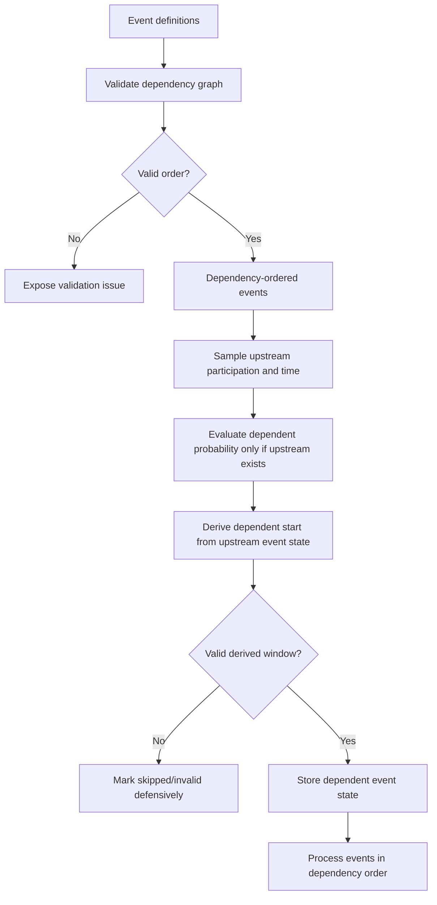

# feat: Dependent Event Timing

## Summary

Implement dependent event timing by making event dependencies drive scheduling, not only firing-time gating. The plan introduces shared dependency ordering and validation, updates one-shot and periodic event scheduling to use upstream event state, and makes the event editor display dependency-controlled start times clearly.

---

## Problem Frame

The origin document describes a mismatch between independent trigger-time sampling and ordered biological event chains. Planning must preserve the existing flexible event model while changing dependency semantics so that downstream event participation and timing are conditional on the upstream event.

---

## Requirements

- R1. Selecting an event dependency automatically makes the dependent event's effective start time equal to the referenced event's sampled time for the same cell.
- R2. A dependent event keeps its configured end time, producing an effective window from dependency time to its own end.
- R3. The manual start value no longer affects scheduling while a dependency is selected.
- R4. Dependent event probability is conditional on upstream participation.
- R5. If an upstream event is skipped, downstream dependent events are skipped.
- R6. A dependent event with probability 1 and a valid window occurs wherever its referenced event occurs.
- R7. Event state initialization and event processing happen in dependency order.
- R8. The event editor makes dependency-controlled start time visible.
- R9. The event editor disables or clearly marks start-time editing while dependency controls the start.
- R10. Help text explains the effective behavior in plain language.
- R11. Circular dependencies are invalid and user-visible.
- R12. Impossible dependent windows are invalid or warned, not silently skipped.
- R13. Missing dependency references are user-visible and recoverable.
- R14. The change may be breaking and does not need full behavioral migration.
- R15. Existing prerequisite semantics are reinterpreted as automatic dependent timing.
- R16. Manual relative-time formulas and sequence groups stay out of scope.

**Origin actors:** A1 Researcher, A2 Implementation planner
**Origin flows:** F1 Configure a dependent event, F2 Sample a dependent chain for a cell, F3 Correct invalid dependency setup
**Origin acceptance examples:** AE1 dependency UI, AE2 conditional implementation rate, AE3 derived sampling window, AE4 skipped upstream propagation, AE5 invalid configuration visibility

---

## Scope Boundaries

- Do not introduce a new persisted event shape for this first implementation; reuse the existing dependency field and event IDs.
- Do not add manual relative-time expressions for start or end fields.
- Do not add a sequence/group authoring model.
- Do not apply dependency semantics to global events in this plan.
- Do not attempt full migration compatibility for old files beyond visible handling of broken references and changed semantics.

### Deferred to Follow-Up Work

- Broader parameter-file versioning for event semantic breaks: useful if future changes need explicit format-level migration policy, but not required for this scoped behavior change.
- Rich dependency visualizations: a graph or timeline view may help later, but the first version should focus on compact field-level clarity.

---

## Context & Research

### Relevant Code and Patterns

- `src/models/eht/params/types.ts` defines `EventDefinition` with `id`, `start`, `end`, `period`, `probability`, `prereq`, and `cell_cycle_phase`; the existing data shape already carries the dependency concept.
- `src/models/eht/simulation/cell.ts` owns `initializeEventStates()` and `inheritEventStates()`, currently sampling each event independently.
- `src/models/eht/simulation/events.ts` owns firing-time behavior, currently checking prerequisites through `has_fired` and then comparing the current timestep to each event's independent `trigger_time`.
- `src/models/eht/ui/EventsEditor.tsx` contains the full event edit form and dependency select; it is the right place to disable and explain the start field.
- `src/models/eht/ui/CellEventsTab.tsx` contains the compact event card, default/per-type event sections, copy/paste behavior, and event dialog wiring.
- `src/models/eht/params/descriptions.ts` centralizes event help text shown in popovers and the Cell Events documentation dialog.
- Existing Vitest coverage is strongest around pure simulation helpers and focused component rendering; new behavior should follow that style with direct unit tests plus a small UI test.

### Institutional Learnings

- `docs/solutions/design-patterns/single-scroll-parameter-workspace-2026-05-19.md` favors shared editor bodies and minimal duplicated UI state in dense parameter panels. The event UI changes should update both compact and dialog views through shared helpers where practical.
- `docs/solutions/architecture-patterns/v2-micron-parameter-format-compatibility-boundary-2026-05-20.md` shows the value of explicit boundaries for scientific parameter semantics. This plan should similarly make changed event semantics explicit in scheduling helpers, tests, and help text instead of burying them inside runtime conditionals.

### External References

- None used. Local event semantics and existing UI patterns are sufficient for this plan.

---

## Key Technical Decisions

- Use one shared dependency utility for ordering and validation: UI and simulation need the same definition of valid event graphs, missing references, and dependency order.
- Keep the existing dependency field as the user-facing and persisted control: this satisfies the breaking semantic change without a new event schema.
- Treat periodic dependent events as dependency-controlled active windows: dependency controls first activation or active-window start, while period continues to control repeat cadence.
- Surface invalid derived windows in UI validation and runtime safeguards: the editor should prevent most bad configurations, but simulation must still handle loaded or generated invalid configs defensively.
- Preserve formula-generated events as independent by default: generated parameter formulas use no dependency and should not be pulled into user-authored dependency validation noise.

---

## Open Questions

### Resolved During Planning

- Impossible derived windows: plan for visible validation and action blocking where the UI has a blocking surface, with runtime safeguards for loaded configs.
- Periodic dependent events: plan for dependency-controlled first activation or active-window start, not one-shot sampled trigger times.
- Broken dependency references: plan visible invalid state and cleanup on delete/copy, not a full migration guarantee.

### Deferred to Implementation

- Exact validation presentation: the implementing agent should choose compact inline text, badges, or disabled-state copy that fits the current event cards without crowding them.
- Exact run/export blocking integration: the implementing agent should use the narrowest existing blocking surface available; if no central simulation-config blocker exists, keep blocking local to event editing/export surfaces and preserve runtime safeguards.

---

## High-Level Technical Design

> *This illustrates the intended approach and is directional guidance for review, not implementation specification. The implementing agent should treat it as context, not code to reproduce.*

---

## Implementation Units

### U1. Shared Dependency Ordering and Validation

**Goal:** Create a pure event dependency helper that can order events and report graph/window/reference problems consistently for simulation and UI.

**Requirements:** R7, R11, R12, R13, R15

**Dependencies:** None

**Files:**
- Create: `src/models/eht/params/event-dependencies.ts`
- Test: `src/models/eht/params/event-dependencies.test.ts`
- Modify: `src/models/eht/params/index.ts`

**Approach:**
- Add a pure helper that accepts an event list and returns dependency-ordered events plus validation results.
- Detect cycles, self-dependencies, duplicate IDs, and dependency references that do not exist in the effective event list.
- Include derived-window validation that can flag obvious impossible windows from static config, while leaving cell-specific runtime checks to simulation.
- Keep formula-generated events out of noisy UI validation unless they are directly involved in a dependency.

**Execution note:** Implement this helper test-first; it becomes the shared contract for the later simulation and UI work.

**Patterns to follow:**
- Existing parameter helpers in `src/models/eht/params/unit-conversion.ts` keep domain-specific rules close to EHT params and export pure utilities with focused tests.
- Existing migration tests prefer small explicit fixtures rather than full app setup.

**Test scenarios:**
- Happy path: unordered events with a dependency are returned in upstream-before-downstream order.
- Happy path: independent events preserve stable relative ordering where possible.
- Edge case: an event depending on itself reports a validation error.
- Edge case: a two-event or multi-event cycle reports a validation error and does not produce a misleading valid order.
- Error path: a dependency pointing to a missing event ID reports a validation error.
- Error path: duplicate event IDs report a validation error because dependency resolution would be ambiguous.
- Error path: a dependent event whose configured end is before the upstream event's fixed end/static timing signal is reported as potentially impossible when detectable from definitions.

**Verification:**
- The helper can be used without React or simulation state.
- Tests demonstrate the same ordered list can drive initialization and processing.

---

### U2. Conditional Event-State Scheduling

**Goal:** Update cell event-state initialization and inheritance so dependent events are sampled only after upstream event participation and timing are known.

**Requirements:** R1, R2, R3, R4, R5, R6, R7, R14, R15

**Dependencies:** U1

**Files:**
- Modify: `src/models/eht/simulation/cell.ts`
- Modify: `src/models/eht/types.ts`
- Test: `src/models/eht/simulation/event-state-scheduling.test.ts`

**Approach:**
- Use dependency-ordered events when initializing and inheriting event states.
- For one-shot independent events, preserve current probability and sampling behavior.
- For one-shot dependent events, evaluate downstream probability only when the upstream event has a finite trigger time, then sample from upstream trigger time to the dependent event's configured end.
- If the upstream event is skipped or the derived window is invalid for a cell, store the dependent event as skipped using the existing infinite trigger-time convention.
- For periodic independent events, preserve current participation-flag behavior.
- For periodic dependent events, inherit upstream participation gating and store enough effective-start information in existing event state fields to let runtime processing begin only after the dependency fires.
- Keep cell cycle phase as an additional firing requirement, not part of trigger-time sampling.

**Technical design:** Directional scheduling rules:

- Independent one-shot: probability gate, then sample from configured start to configured end.
- Dependent one-shot: upstream finite trigger time required, then probability gate, then sample from upstream trigger time to configured end.
- Independent periodic: probability gate controls participation; configured start/end remain active window.
- Dependent periodic: upstream finite trigger time required; dependency fire time becomes active-window start; configured end remains the active-window end.

**Patterns to follow:**
- Existing `initializeEventStates()` and `inheritEventStates()` use `SeededRandom` and `Infinity` as the skipped-event sentinel.
- Existing formula probability evaluation already supports general params, cell-type params, constants, and math.js helpers.

**Test scenarios:**
- Covers AE2. Happy path: upstream probability 0.8 and dependent probability 1 produce dependent finite trigger times exactly for cells where upstream trigger times are finite.
- Covers AE3. Happy path: upstream trigger time 8 and dependent end 12 produces a dependent trigger time in the inclusive 8-to-12 window.
- Covers AE4. Happy path: skipped upstream event causes dependent event to be skipped without evaluating it independently.
- Edge case: dependent probability 0 skips downstream even when upstream participates.
- Edge case: dependent probability 0.5 is conditional on upstream participation, not the total cell population.
- Edge case: dependent configured start differs from upstream time; scheduling ignores configured start while dependency exists.
- Error path: invalid derived window stores a defensive skipped state and records or exposes validation through the helper path rather than throwing during initialization.
- Integration: cell cycle reset and cell division inheritance keep conditional scheduling semantics for newly initialized one-shot states.

**Verification:**
- Event-state tests are deterministic for a fixed seed.
- Existing formula-generated events with no dependency continue to initialize as before.

---

### U3. Runtime Event Processing in Dependency Order

**Goal:** Make timestep event processing respect dependency order and dependency-controlled active windows, especially for same-timestep chains and periodic dependent events.

**Requirements:** R1, R5, R6, R7, R15

**Dependencies:** U1, U2

**Files:**
- Modify: `src/models/eht/simulation/events.ts`
- Test: `src/models/eht/simulation/events.test.ts`
- Test: `src/models/eht/simulation/event-state-scheduling.test.ts`

**Approach:**
- Process effective events in the same dependency order used at initialization.
- Reinterpret prerequisites as dependency timing semantics rather than a separate hidden trigger blocker, while still preventing downstream execution before upstream has fired.
- For one-shot dependent events, rely on the derived trigger time and dependency-ordered processing so valid chains fire when their sampled times are crossed.
- For periodic dependent events, use the dependency fire time as the active-window start and repeat according to the existing period cadence.
- Keep terminal event behavior for cell division and cell cycle reset intact, including existing safeguards that avoid firing multiple terminal events for the same cell in one pass.
- Keep apical interface processing deferred by cell type as it is today.

**Patterns to follow:**
- Current `processV2Events()` already separates event eligibility, event execution, terminal-event collection, and deferred structural work.
- Existing global event tests show the pattern for one-time and periodic firing windows.

**Test scenarios:**
- Happy path: a dependent event listed before its upstream event in the raw list still fires after the upstream event because processing uses dependency order.
- Happy path: two one-shot dependent events with the same effective timestep fire in upstream-before-downstream order when eligible.
- Happy path: a dependent periodic event starts only after the upstream event has fired, then repeats according to its period.
- Edge case: a dependent event whose upstream has a finite trigger time but has not fired yet does not fire early.
- Edge case: cell cycle phase gating still prevents firing until the phase condition is satisfied, even if the dependency timing is satisfied.
- Error path: missing dependency state prevents firing and is visible through validation rather than crashing the timestep.
- Integration: terminal event behavior for cell division/cell cycle reset remains single-terminal-per-cell.

**Verification:**
- Runtime tests prove the old independent-prerequisite failure mode is gone for the ordered 6h-12h scenario.
- Existing tests for global events, formula events, statistics, and force behavior remain unaffected.

---

### U4. Event Editor Dependency UX and Validation

**Goal:** Make dependency-controlled start times visible and non-editable in the event editor, and surface invalid dependency graphs where researchers configure events.

**Requirements:** R1, R2, R3, R8, R9, R10, R11, R12, R13

**Dependencies:** U1

**Files:**
- Modify: `src/models/eht/ui/EventsEditor.tsx`
- Modify: `src/models/eht/ui/CellEventsTab.tsx`
- Test: `src/models/eht/ui/CellEventsTab.test.tsx`
- Test: `src/models/eht/ui/EventsEditor.test.tsx`

**Approach:**
- In the full event editor, when a dependency is selected, display start as derived from the dependency and make the numeric start input non-editable.
- Keep the end-time input editable for dependent events.
- In the compact event card, show a concise dependency-derived start indicator rather than implying the start value is still manually active.
- Use the shared dependency validation helper to mark cycles, missing references, duplicate IDs, and impossible windows.
- Preserve existing delete behavior that clears references to deleted events, and keep paste behavior clearing dependencies that may not make sense in the target list.
- For default events and per-type events, validate within each event list independently, matching the effective scope the editor is showing.

**Patterns to follow:**
- `CellEventsTab.tsx` already clears copied-event dependencies on paste when they may be invalid.
- `CellTypesTab.tsx` demonstrates compact per-cell error text with destructive border styling for invalid fields.
- `ExportConfigDialog.tsx` demonstrates collecting validation errors and disabling the primary action when the configuration is invalid.

**Test scenarios:**
- Covers AE1. Happy path: selecting a dependency disables the start field, shows dependency-derived start text, and leaves the end field editable.
- Covers AE5. Error path: a circular dependency renders a visible validation state.
- Covers AE5. Error path: a missing dependency reference renders a visible validation state or is cleared by the relevant cleanup behavior.
- Happy path: deleting an event clears dependent references that pointed to it.
- Happy path: pasting an event into another cell type clears the copied dependency.
- Edge case: default event editing validates against default events, and per-type editing validates against the selected cell type's events.
- Accessibility: dependency-derived start state is available through visible text or accessible labels, not only color.

**Verification:**
- Component tests cover both compact-card and dialog-editor surfaces.
- The UI does not mount separate divergent implementations of dependency semantics.

---

### U5. Documentation, Help Text, and Semantic Notes

**Goal:** Update user-facing documentation and parameter descriptions so the new probability and timing semantics are discoverable.

**Requirements:** R8, R10, R14, R15, R16

**Dependencies:** U2, U3, U4

**Files:**
- Modify: `src/models/eht/params/descriptions.ts`
- Modify: `docs/events.md`
- Test: `src/models/eht/params/descriptions.test.ts`

**Approach:**
- Update event time-range help to explain that dependencies override manual start time.
- Update probability help to explain conditional downstream probability.
- Update prerequisite/dependency help to say dependency now controls scheduling, not just firing eligibility.
- Update the Cell Events overview with examples for skipped upstream propagation and periodic dependent activation.
- Update `docs/events.md` so the Julia/TypeScript comparison no longer describes TypeScript prerequisites as only firing-time checks.

**Patterns to follow:**
- Existing descriptions use dot-notation keys and Markdown/KaTeX where useful.
- Existing docs use comparison tables and concise behavior summaries.

**Test scenarios:**
- Happy path: description lookup returns updated time-range, probability, and dependency text.
- Happy path: event overview mentions conditional probability and dependency-controlled start time.
- Test expectation for `docs/events.md`: none -- markdown docs are reviewed as source references rather than rendered in the app test suite.

**Verification:**
- Event help no longer teaches obsolete independent sampling plus firing-time prerequisite semantics.
- Researchers can understand the behavior from the editor without needing to inspect source code.

---

## System-Wide Impact

- **Interaction graph:** Event definitions flow through TOML/default params, event editor, state initialization, timestep processing, batch/headless simulation, and docs. Shared dependency utilities reduce drift across those surfaces.
- **Error propagation:** UI validation should catch editable invalid graphs; runtime scheduling and processing still need defensive behavior for loaded or generated invalid configs.
- **State lifecycle risks:** Cell cycle reset and division reinitialize or inherit event states, so conditional scheduling must be applied there as well as at initial simulation setup.
- **API surface parity:** Browser, CLI, batch workers, and headless model share the same EHT simulation code, so scheduling changes automatically affect all run modes.
- **Integration coverage:** Unit tests cover helper and simulation behavior; UI component tests cover field affordances. Full browser visual verification is not required unless implementation substantially changes layout.
- **Unchanged invariants:** Event IDs remain the dependency reference mechanism; event type shapes, TOML structure, formula syntax, and global events remain unchanged.

---

## Risks & Dependencies

| Risk | Mitigation |
|------|------------|
| Existing user files with prerequisites behave differently after this breaking change | Document the semantic break and avoid pretending full migration compatibility exists. |
| UI validation and simulation scheduling diverge | Use a shared dependency-ordering and validation helper consumed by both surfaces. |
| Periodic dependency semantics become ambiguous | Treat dependency as first activation/active-window start and document that explicitly. |
| Default INM dependency changes unexpectedly | Add regression tests for the built-in INM-style dependent event chain and preserve cell phase gating. |
| Invalid loaded configs bypass editor validation | Keep runtime defensive behavior for cycles, missing references, and impossible derived windows. |

---

## Documentation / Operational Notes

- Update user-facing help and `docs/events.md` in the same change as runtime semantics so researchers do not see obsolete event-chain explanations.
- Because the change is intentionally breaking, release notes or PR description should call out that `prereq` now changes sampling semantics.
- No new runtime dependency is expected.

---

## Sources & References

- **Origin document:** [docs/brainstorms/2026-05-22-dependent-event-timing-requirements.md](docs/brainstorms/2026-05-22-dependent-event-timing-requirements.md)
- Related docs: `docs/events.md`
- Related code: `src/models/eht/params/types.ts`
- Related code: `src/models/eht/simulation/cell.ts`
- Related code: `src/models/eht/simulation/events.ts`
- Related UI: `src/models/eht/ui/EventsEditor.tsx`
- Related UI: `src/models/eht/ui/CellEventsTab.tsx`
- Related help text: `src/models/eht/params/descriptions.ts`
- Institutional learning: `docs/solutions/design-patterns/single-scroll-parameter-workspace-2026-05-19.md`
- Institutional learning: `docs/solutions/architecture-patterns/v2-micron-parameter-format-compatibility-boundary-2026-05-20.md`
